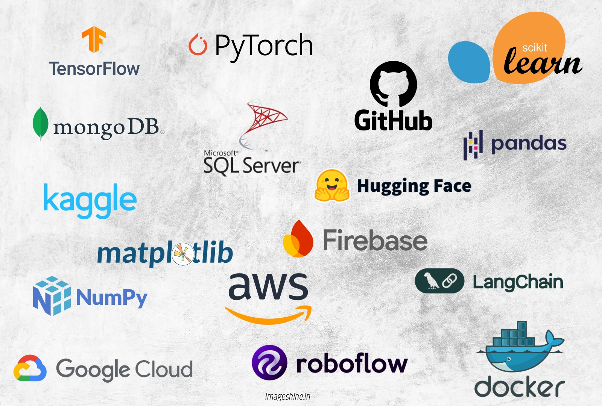
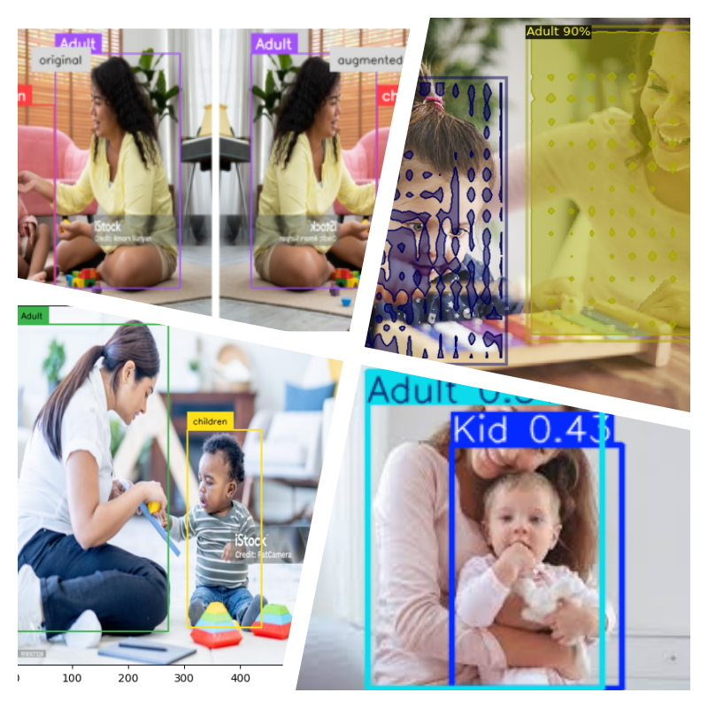
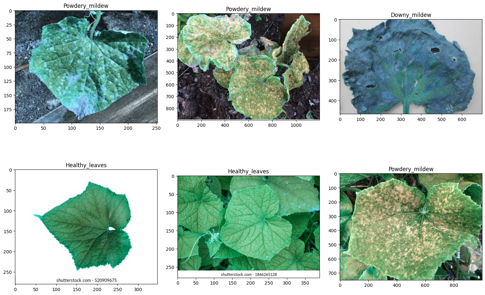
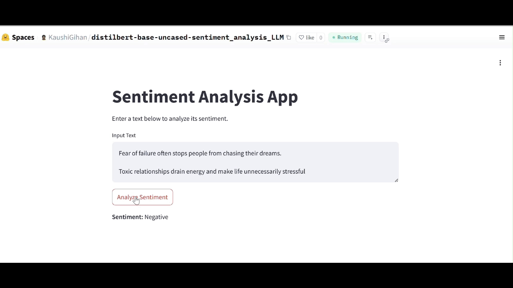
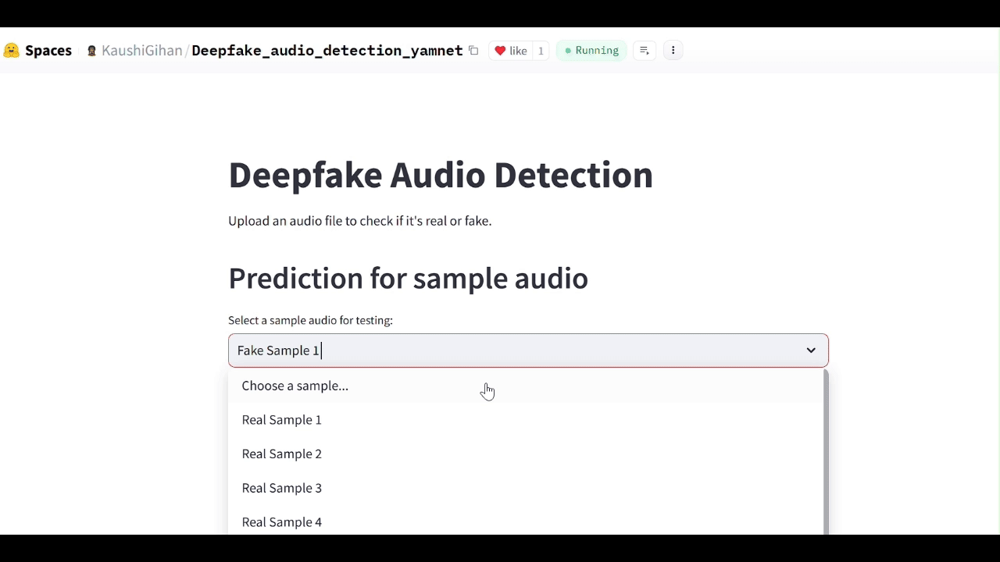

# FRAMEWORKS AND TOOLS
* * *

# PROJECTS
* * *
 
## Personal and R&D projects
## 🔍 Computer vision 

### 	Children and Adults Detection for Safety Camera System | 2024 |
<table cellspacing="0" cellpadding="0"  border="0">
  <tr>
    <td width="50%" align="center">
      
    </td>
    <td width="50%" valign="top">
      Developed an AI-powered safety camera system that detects adults and children in real-time while analyzing children's behavior. 
      The system enhances security by sending instant alerts to parents or guardians, ensuring proactive monitoring in homes, schools, and public spaces. 
      Using state-of-the-art deep learning models, the system accurately identifies individuals and behaviors, reducing safety risks and enabling timely interventions. 
     <b> Technologies Used:</b> 
     YOLO, DETR, Faster R-CNN, SSD, Computer Vision, Deep Learning 
     <b> Project Impact:</b> 
     Designed and developed the detection model, ensuring high accuracy and real-time performance, improving child safety monitoring and parental awareness. 
     <b> Demo project Github Repository:</b><a href="https://github.com/KaushiML3/Kids_and_Adults_detection-faster-RCNN_yolo_Detr" target="_blank">Click Here</a>
    </td>
  </tr>
</table>

### cucumber leaf diseases classification

- Cucumber leaves are susceptible to various diseases, primarily fungal and bacterial. Common issues include powdery mildew, which forms white, powdery spots on leaves, and downy mildew, characterized by yellow patches and a fuzzy underside. Anthracnose causes dark, sunken spots on leaves and fruit, while angular leaf spot results in water-soaked lesions that become angular and brown.Bacterial wilt, spread by cucumber beetles, causes leaves to wilt and die. Proper spacing, crop rotation, and the use of resistant varieties can help manage these diseases, along with timely fungicide or bactericide applications.
  

  
- Technologies Used
  - **Custom CNN Architecture** – Designed a specialized deep learning model for disease classification
  - **VGG16 :** Leveraged a pre-trained model for feature extraction and enhanced accuracy
  - **Computer Vision:**  Image processing for disease identification
  - **Deep Learning (TensorFlow/Keras):**  Training and fine-tuning the model for classification
    
Developed a custom architecture and fine-tuned VGG16, improving disease detection accuracy.Enabled early disease identification, helping farmers take preventive action and reduce crop loss.

- **Github Repository:**[Click Here](https://github.com/KaushiML3/Cucumber-Leaf-Disease-Classification-CNN-VGG16-VIT/tree/main)

### Multilabel Classification CNN and Vision-Transformer 
- This repository implements an Image Multi-Label Classification model, which can identify multiple labels in a single image. Unlike traditional image                         classification, where an image is assigned a single category, multi-label classification allows an image to have multiple labels simultaneously.
- 

- **Github Repository:**[Click Here](https://github.com/KaushiML3/Cucumber-Leaf-Disease-Classification-CNN-VGG16-VIT/tree/main)

### Tranfer Learning - Vision Transformer: 

- Vision Transformers (ViTs) are a type of neural network architecture designed primarily for processing images. Unlike traditional convolutional neural networks (CNNs), which process images in a hierarchical manner, ViTs apply self-attention mechanisms to capture global dependencies between image patches. This allows them to achieve strong performance on various computer vision tasks without relying on convolutional layers. ViTs have gained popularity for their ability to handle long-range dependencies effectively, making them suitable for tasks like image classification, object detection, and segmentation. The original Vision Transformer developed by Google. It divides images into patches, processes them as tokens, and applies transformer layers.This repository include how to fine tune the vision transformer model.
- **Github Repository:**[Click Here](https://github.com/KaushiML3/Vision_Transformer_Transfer_Learning)

## 📖 Natural Language Processing

### Sentiment Analysis & Automated Reply System for Shopping App |2024|
- Developed an AI-powered sentiment analysis and automated reply system for a shopping app to enhance customer interaction and support. The system analyzes customer feedback in real time, classifies sentiments (positive, neutral, negative), and triggers automated responses based on sentiment categories. By leveraging a fine-tuned DistilBERT model, the system ensures high accuracy in understanding customer emotions and delivering relevant responses. This solution improves customer satisfaction, reduces response time, and optimizes customer engagement.

- **sentiment analysis DistilBERT model demo**

- Technologies Used
  - **DistilBERT:** Lightweight transformer-based model for sentiment classification
  - **LoRA (Low-Rank Adaptation):** Efficient fine-tuning technique for optimizing DistilBERT
  - **Hugging Face Transformers:** Model training, fine-tuning, and deployment
  - **NLP (Natural Language Processing):** Text analysis and sentiment detection
  - **Python:** Backend implementation and integration
  - **FastAPI:** Lightweight API framework for deploying sentiment analysis and automated responses

- Project Impact
  - Fine-tuned the DistilBERT model using LoRA, improving sentiment classification accuracy with efficient parameter updates.
  - Optimized real-time sentiment detection, enabling instant automated responses to customer feedback.
   
- **Demo project Github Repository:** [Click Here](https://github.com/KaushiML3/Fine-tuning-a-LLM-for-sentiment-analysis)
- **Demo project Hugging face space:** [Click Here](https://huggingface.co/spaces/KaushiGihan/distilbert-base-uncased-sentiment_analysis_LLM)

    
### Simple NLP projects
- **Language Detection:** A model that identifies the language of a given text, enabling automated localization and multilingual processing.
- **Spam Message Detection:** A system that classifies messages as spam or not, helping to filter unwanted content and improve communication efficiency.
- **Suspicious URL Detection:** A model that detects malicious or suspicious URLs, enhancing security by identifying potential phishing attempts or harmful websites.
- **Obfuscated JavaScript Detection:** A tool to analyze and detect obfuscated JavaScript code, helping to identify potentially malicious scripts in web applications.

- **Github Repository:**[Click Here](https://github.com/KaushiML3/Simple-NLP-projects/tree/main)
- **Hugging face space:**[Click Here](https://huggingface.co/spaces/KaushiGihan/simple_language_and_spam_message_detection)

### Transformer Language translation 
-This repository contains a Transformer-based language translation model trained to translate Portuguese to English. The implementation follows a simplified approach using TensorFlow/Keras and includes a Jupyter Notebook demonstrating training on a small dataset for quick experimentation
- **Github Repository:**[Click Here](https://github.com/KaushiML3/Transformer_Language-translation)

## 🤖 Audio and other
### Numerical audio authentication system Deep learning.
- This project implements a deep learning-based voice number authentication system using CNN and a Siamese Network. It verifies spoken numbers by comparing voice embeddings to reference samples. The model extracts audio features (MFCC, spectrogram) using CNN and determines similarity through a Siamese architecture.
  

- **Github Repository:**[Click Here](https://github.com/KaushiML3/Numerical-audio-authentication-system_Deep-learning)

### Deepfake voice detection 
- This project contains a machine learning-based system to detect deepfake (synthetic) voices. The system utilizes audio feature extraction techniques such as YAMNet and deep learning models (ANN, CNN, RNN) to differentiate between real and fake audio.
  

- **Github Repository:**[Click Here](https://github.com/KaushiML3/Deepfake-voice-detection_Yamnet)
- **Hugging face space:**[Click Here](https://huggingface.co/spaces/KaushiGihan/Deepfake_audio_detection_yamnet)

### libfinder
- libfinder is a simple Python package that helps check if a library is installed in your python jupyter environment.
- **Github Repository:**[Click Here](https://github.com/KaushiML3/libfinder)

### **AWS Elastic beanstalk _EC2_ECR-Demo**
- This repository contains the source code and deployment configuration for simple python app, a web-based platform for project management. The application is hosted on AWS, leveraging the power of cloud infrastructure for scalability, reliability, and performance
- - **Github Repository:**[Click Here](https://github.com/KaushiML3/AWS_Elastic_beanstalk_EC2_ECR_Demo)

# USED MODEL AND ARCHITECTURES
* * *

<table>
  <tr>
    <th>Natural Language Processing</th>
    <th>Computer Vision</th>
    <th>Audio</th>
    <th>Other</th>
  </tr>
  <tr>
    <td>
      • LSTM, BiLSTM, GRU  
      • BERT  
      • T5  
      • GPT   
      • Llama  
      • spaCy  
      • Hugging Face  
    </td>
    <td>
      • CNN 2D  
      • VGG16  
      • ResNet50  
      • Vision Transformer  
      • YOLO  
      • DETR  
      • Faster R-CNN  
      • SSD  
    </td>
    <td>
      • YamNet  
      • Wav2Vec  
      • Whisper  
      • Kaldi  
    </td>
    <td >
      • EasyOCR  
      • Keras OCR  
      • Tesseract OCR  
      • Google Cloud Vision OCR  
      • Amazon Textract
    </td>
  </tr>
</table>

<h2> 🌐 CONTACT INFORMATIONs</h2>
<ul>
  <li><b>Email:</b> <a href="mailto:kaushigihan@gmail.com">kaushigihan@gmail.com</a></li>
  <li><b>LinkedIn:</b> <a href="https://www.linkedin.com/in/kaushika-rupasinghe-967021b2/" target="_blank">LinkedIn Profile</a></li>
  <li><b>GitHub:</b> <a href="https://github.com/KaushiML3" target="_blank">GitHub Profile</a></li>
  <li><b>Kaggle:</b> <a href="https://www.kaggle.com/kaushigihanml" target="_blank">Kaggle Profile</a></li>
  <li><b>Hugging Face:</b> <a href="https://huggingface.co/KaushiGihan" target="_blank">Hugging Face Profile</a></li>
</ul>

---

Thank you for visiting my profile! Feel free to explore, contribute, or reach out for collaborations! 🙌

